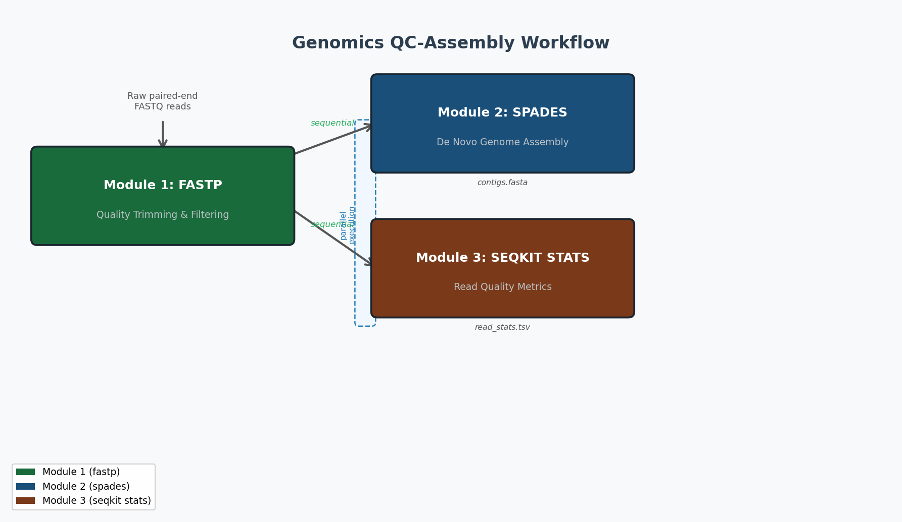

# Nextflow Genomics Workflow
**BIOL7210 — Workflow Exercise**

A three-module Nextflow (DSL2) pipeline that performs quality trimming, de novo genome assembly, and read statistics on paired-end bacterial FASTQ data.

---

## Workflow Overview

```
Raw paired-end FASTQ
        │
        ▼
┌───────────────────┐
│  Module 1: FASTP  │  Quality trimming & adapter removal
└───────────────────┘
        │
        ├──────────────────────┐
        │  (parallel)          │  (parallel)
        ▼                      ▼
┌───────────────────┐  ┌────────────────────────┐
│  Module 2: SPADES │  │ Module 3: SEQKIT STATS  │
│  De Novo Assembly │  │  Read Quality Metrics   │
└───────────────────┘  └────────────────────────┘
```

**Sequential**: raw reads → FASTP (Module 1) → trimmed reads feed both downstream modules.  
**Parallel**: SPADES (Module 2) and SEQKIT STATS (Module 3) run simultaneously on FASTP output.



---

## Requirements

| Dependency  | Version  | Notes                                |
|-------------|----------|--------------------------------------|
| Nextflow    | 24.10.5  | `conda create -n nf -c bioconda nextflow=24.10.5 -y` |
| Conda       | ≥ 24.1   | Package manager (Miniconda or Anaconda) |
| OS          | macOS (Darwin 24.6.0) / Linux / WSL2 |             |
| Architecture| arm64 / x86_64                       |             |

Each module installs its own conda environment automatically:

| Tool         | Version | Role              |
|--------------|---------|-------------------|
| fastp        | 0.23.4  | QC + trimming     |
| SPAdes       | 3.15.5  | Genome assembly   |
| seqkit       | 2.8.2   | Read statistics   |

---

## Test Data

Real paired-end Illumina FASTQ files are included in `test_data/`:

```
test_data/
├── test_R1.fastq.gz   # 50,000 reads × 150 bp (R1)
└── test_R2.fastq.gz   # 50,000 reads × 150 bp (R2)
```

Reads are a 50,000-read subset of NCBI SRA accession **SRR2584863** — *Escherichia coli* K-12 MG1655 evolved strain (Lenski long-term evolution experiment), Illumina HiSeq 2500, 150 bp paired-end. Downloaded from the EBI/ENA mirror.

---

## Quick Start (≤ 3 commands)

**1. Activate Nextflow environment:**
```bash
conda activate nf
```

**2. Run the workflow with conda and test data:**
```bash
nextflow run main.nf -profile conda,test
```

**3. (Optional) Resume a failed run:**
```bash
nextflow run main.nf -profile conda,test -resume
```

Expected runtime on a laptop: **< 15 minutes** for the test dataset.

---

## Output Structure

```
results/
├── fastp/
│   └── test/
│       ├── test_trimmed_R1.fastq.gz
│       ├── test_trimmed_R2.fastq.gz
│       ├── test_fastp.json
│       └── test_fastp.html
├── spades/
│   └── test/
│       └── test_contigs.fasta
└── seqkit/
    └── test/
        └── test_read_stats.tsv
```

---

## Repository Structure

```
.
├── main.nf                    # Main workflow (DSL2)
├── nextflow.config            # Parameters, profiles, resources
├── modules/
│   ├── fastp.nf               # Module 1 — quality trimming
│   ├── spades.nf              # Module 2 — de novo assembly
│   └── seqkit.nf              # Module 3 — read statistics
├── test_data/
│   ├── test_R1.fastq.gz       # Real E. coli reads, SRR2584863 (R1)
│   └── test_R2.fastq.gz       # Real E. coli reads, SRR2584863 (R2)
└── assets/
    ├── workflow_diagram.png   # Workflow illustration
    └── create_diagram.py      # Script used to generate diagram
```

---

## Debugging Tips

```bash
# View full execution log
nextflow log

# Trace resource usage per task
nextflow run main.nf -profile conda,test -with-trace

# Generate execution timeline HTML
nextflow run main.nf -profile conda,test -with-timeline timeline.html

# Generate DAG image
nextflow run main.nf -profile conda,test -with-dag dag.png
```
